# High-Level System Architecture

This diagram illustrates the main components and their connections in the `agentic_ai_system` project.

---

## Mermaid Diagram

```mermaid
graph TD
    web[Web Frontend] -- Stream/API(/query) --> orchestration[Orchestration Layer<br>-Handles requests, coordinates agents, retry<br>-guardrail, memory]
    orchestration -- Stream/Result --> web
    orchestration -- Compose Results --> composer[🤖 Composer Agent]
    
    orchestration <-- Store/Retrieve --> memory[💾 Memory Store]
    orchestration <-- Safety/Validation --> utils[⚠️ Utils/Validators]


    orchestration -- Retriev data --> text_to_sql[🤖 Text-to-SQL Agent]
    text_to_sql -- Prompt/Schema<br>(generate sql) --> llm_models[🧠 LLM Models<br>gemini-2.5-flash-lite]
    text_to_sql -- SQL Query --> sql_executor[🛠️ SQL Executor]
    sql_executor -- Execute SQL --> db[MariaDB]
    text_to_sql -- Knowledge --> knowlages[🧾 Knowlages]
    text_to_sql -- Schema Retriever --> schema_retriever[Schema Retriever]
    schema_retriever -- Execute SQL --> db[🛢️ MariaDB]
    composer -- Compose --> llm_models
    db -- Data --> sql_executor
```

---

## Component Overview

- **Web Frontend**: User interface, streams results and interacts via API.
- **Orchestration Layer**: Handles requests, coordinates agents, manages memory and validation.
- **Text-to-SQL Agent**: Converts text queries to SQL, interacts with LLM and schema retriever.
- **LLM Models**: Large Language Models (e.g., Gemini) used for prompt generation and composition.
- **SQL Executor**: Executes SQL queries, interacts with MariaDB, composes results.
- **Composer Agent**: Formats and composes final output using LLM.
- **Memory Store**: Stores and retrieves session/context data.
- **Utils/Validators**: Ensures prompt safety and SQL hygiene.
- **Knowlages**: Domain knowledge files for text-to-sql agent.
- **Schema Retriever**: Retrieves database schema for query generation.
- **MariaDB**: Database backend for SQL execution.

---

This diagram and overview provide a high-level understanding of the system's architecture and component interactions.
